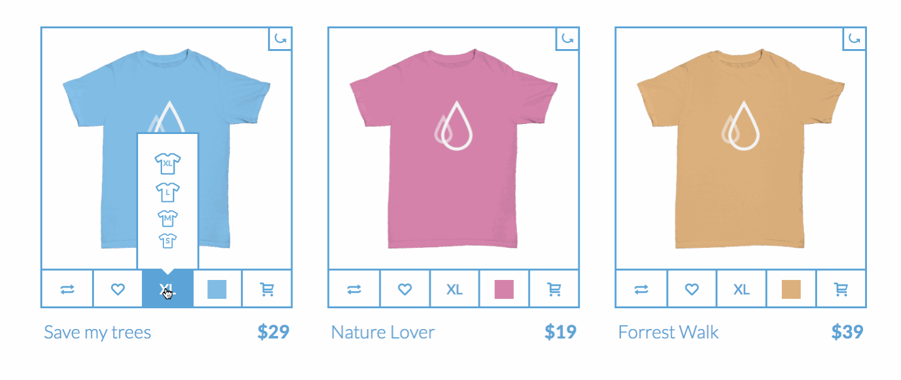

# html-intro-3-tshirts

## Description

This assignment serves to reinforce responsive layouts, exercise positioning with CSS, and demonstrate uses of opacity/transitions/keyframes.

## Objectives

- exercise control of CSS display types, positioning, animations
- reinforce concepts of layout and `display` types

### Learning Objectives

After completing this assignment, you should be able to create a responsive layout in HTML and CSS from scratch.

### Performance Objectives

After completing this assignment, you should be able to effectively:

- create complex, multi-column layouts, with a variety of different methods; combining multiple approaches to achieve truly creative interface potential

## Details

### Deliverables

- a git repo containing:
    - `index.html`
    - stylesheets (in a `css/` directory)
    - `images` folder
        - with any images you used with your design

### Requirements

- A pull request with code to recreate the layout and transitions below
- 3 wide grid with max-width so that images do not stretch
- Hover state for all of the buttons on the bottom
- Pop up menus above the bottom menu

- Hard Mode
    + When a user clicks on the store item show the back side using a 3d card

## Normal Mode

Recreate the following layout in HTML and CSS:

## Notes

Notes go here...

## Additional Resources

- http://learnlayout.com/
- List of HTML tags: https://developer.mozilla.org/en-US/docs/Web/HTML/Element
- List of HTML attributes: https://developer.mozilla.org/en-US/docs/Web/HTML/Attributes
- All the CSS properties! https://developer.mozilla.org/en-US/docs/Web/CSS/Reference
- Don't over think it grids: https://css-tricks.com/dont-overthink-it-grids/
- CSS Tricks Transitions: https://css-tricks.com/almanac/properties/t/transition/
- CSS Tricks Transform: https://css-tricks.com/almanac/properties/t/transform/
- Dropdown Inspiration: http://codepen.io/tag/dropdown/
