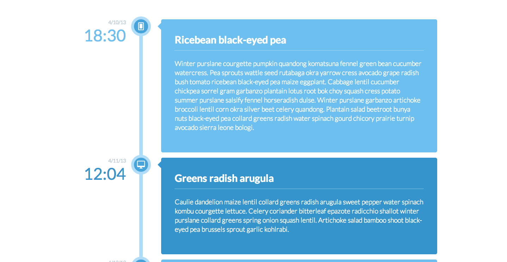

# html-intro-4-timeline

## Description

This assignment serves to reinforce responsive layouts, exercise positioning with CSS, and demonstrate uses of opacity/transitions/keyframes.
And this will be a test of setting up your project with the proper boilerplate and build tools using Broccoli and SASS.

## Objectives

- exercise control of CSS display types, positioning, animations
- reinforce concepts of layout and `display` types
- reinforce concepts of SASS
- reinforce concepts of Broccoli

### Learning Objectives

After completing this assignment, you should be able to create a responsive layout in HTML and CSS from scratch.

### Performance Objectives

After completing this assignment, you should be able to effectively:

- create complex, multi-column layouts, with a variety of different methods; combining multiple approaches to achieve truly creative interface potential

## Details

### Deliverables

* A repo containing at least:
    - `index.html`
    - stylesheets (`scss/`, `css/`, and `dist/` folders)
    - `images` folder
        - with any images you used with your design

### Requirements

- An index.html with semantic HTML
    + Componentized Timelines and Events
- An SCSS file with at least
    + One variable
    + One import statement to bring in a third-party CSS file
- Timeline styling
    + Date
    + Time
    + Icon
    + Event Name
    + Description

## Normal Mode

Recreate the following layout in HTML and CSS:



## Starting HTML

Your HTML should start with this:

```
<!DOCTYPE html>
<html lang="en">
<head>
    <meta charset="utf-8">

    <meta name="viewport" content="width=device-width, initial-scale=1">
    <link rel="stylesheet" href="app.css">

    <title>The Iron Yard Timeline</title>
</head>
<body>
    <ul class="timeline">
        <li class="event">
            <!-- Your code for one event goes here -->
        </li>
    </ul>
</body>
</html>
```

## Additional Resources

- http://learnlayout.com/
- List of HTML tags: https://developer.mozilla.org/en-US/docs/Web/HTML/Element
- List of HTML attributes: https://developer.mozilla.org/en-US/docs/Web/HTML/Attributes
- All the CSS properties! https://developer.mozilla.org/en-US/docs/Web/CSS/Reference
