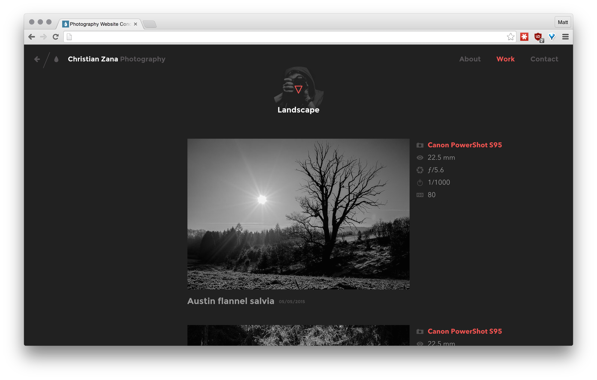
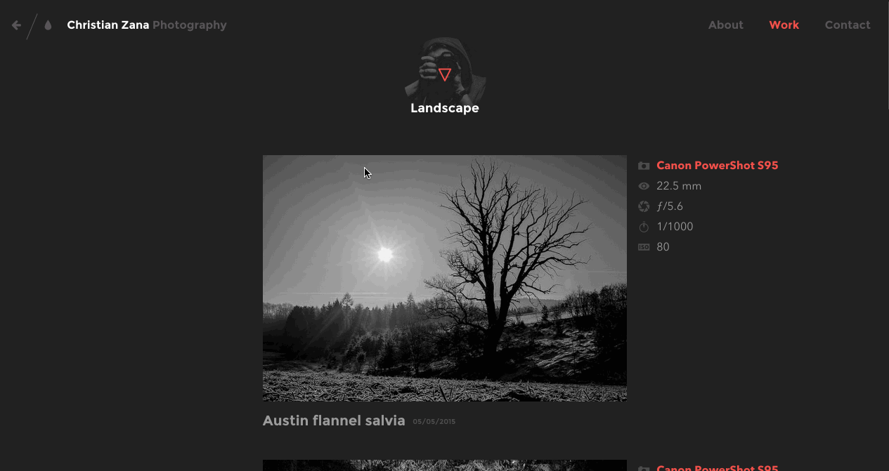

# html-design-challenge-photography-site

## Description

This is a challenge to take a flat set of images, and recreate the design in HTML/CSS.
This will also test your use of SCSS, Bourbon, and Neat Skills

## Objectives

### Learning Objectives

After completing this assignment, you should be able to:

- demonstrate the 4 different methods of layout (inline-block, floats, position/absolute, and flexbox)
- have a strong grasp of various HTML elements and their default styles
- have a strong grasp of CSS selectors, identifiers, combinators, pseudo-classes, and pseudo-elements
- understand the different CSS types and keywords, especially colors and dimensional values
- have a strong grasp of various CSS properties and their values
- create well named variables to allow easy site theming

### Performance Objectives

After completing this assignment, you be able to effectively turn a flat design image into a structured, semantic, and responsive webpage in HTML and CSS.

### Deliverables

* A repo containing at least:
    * The default file structure
* Multiple SCSS partials files
* A centralized set of variables to allow changing the site theme (grid sizes, color scheme, etc)
* Your site hosted on Github Pages
    - Link to your Github pages in the Issue for this assignment

### Requirements

* Your HTML and CSS should be valid.
    - https://validator.w3.org/
    - http://csslint.net/
* Styling for:
    - Photos
    - Icons
    - Photo information
        + Title
        + Date
        + Camera Model
        + Sensor Size
        + f-stop
        + ISO
        + Shutter Speed
    - Company Name Above Image ("Landscape")
    - Responsive Style on Desktop
        + Photo Camera Info to the side of image
        + Photo Title and Date Below Photo
    + Hide Navbar Links On Mobile & Show Hamburger Icon
    + Footer Section
        * 2 wide photos with links and hover state

* Hard Mode Requirements:
    - Make the navbar shoot out from the side on mobile

## Normal Mode

Implement the HTML and CSS needed for this design:

## Hard Mode

Attempt to make the navbar "come in" from the right when a user clicks on the "Hamburger" icon.

## Content Resources

* http://hipsum.co/
* http://vsco.co
   * Click on "Grid"
   * Click on Any Photo
   * Scroll down and click on "..." to get photo sensor info
