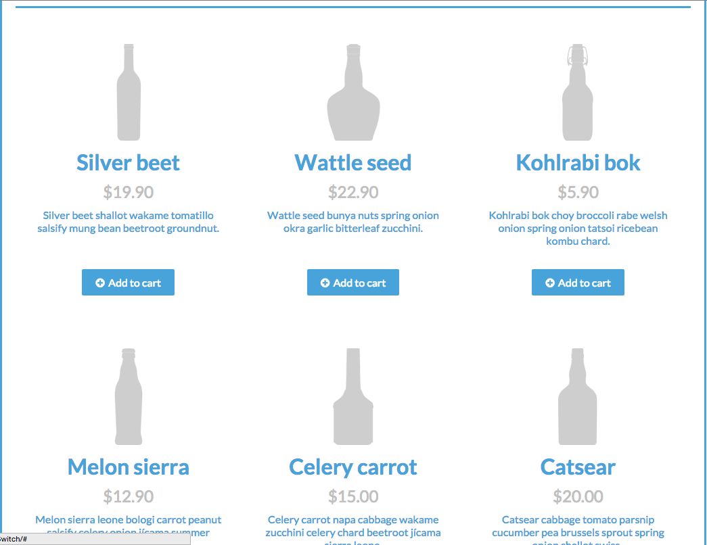
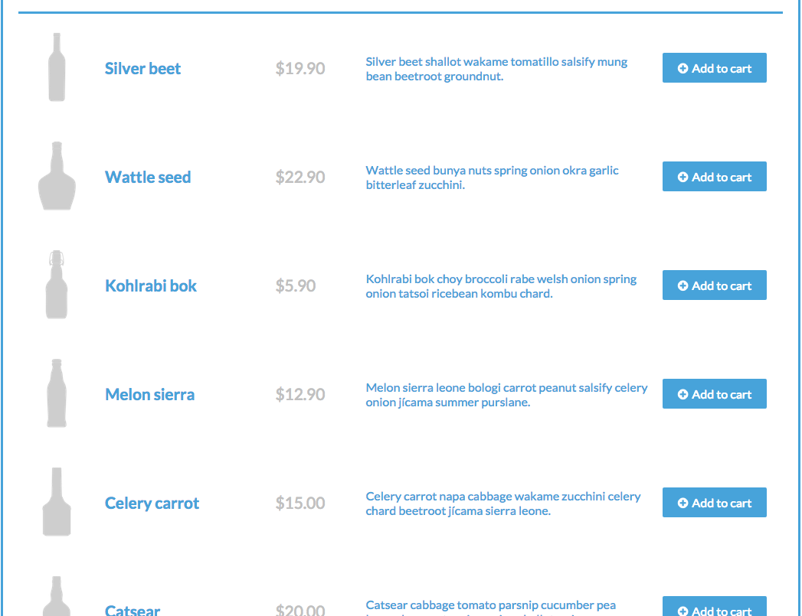

# Beer Take 2

## Objectives

After completing this assignment, you should be able to:

* Demonstrate understanding of application state vs UI
* Demonstrate ability to use Handlebars.js
* Demonstrate knowledge of global scope
* Demmontrate ability to use array.forEach

## Setup

```sh
# cd into week directory
# then hub clone tiy-lr-fee-2015-June/4.1-beer
# then hub create to create the repo on Github, too
# run npm install
# run bower install
# DO WORK
```

## Deliverables

* A publicly visible website (gh-pages) and link to this in your issue

## Requirements

* Recreate the beer layout using SCSS, Bourbon, and Neat
* Use handlebars with a template to beer items from the provided data
* Use `array.forEach` to iterate over your array rather than `{{#each}}{{/each}}` loops
* Clicking on a button on the page uses `classList` to switch between list mode and grid mode
* Do not use jQuery - we haven't covered it so this SHOULDN'T be a problem
* Variables in `app.js` should not pollute the global scope (think self invoking anonymous functions)

## Normal Mode

You're going to recreate the below layouts using provided Javascript data and Handlebars.

You should use `array.forEach` + Handlebars to incrementally add items to the page.

Instead of using `@media` queries, you should have a styled button that allows you to switch from list to tile state.

### Grid State



### List State




## Fetching Beer Data

The project provided comes with a `beer-data.js` file with all of the data needed to make this happen in a `beerData` variable (for the beer picture, use a stock image from [here](../2.1-beer-layout/bottle-1.png)).

You will have to dig into this `beerData` object to get the actual array of data since it also includes some extra meta data.
