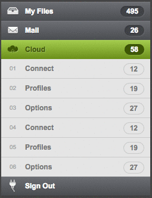
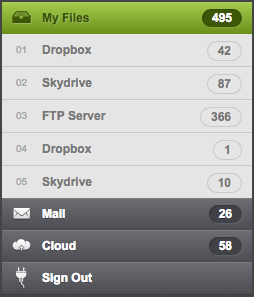
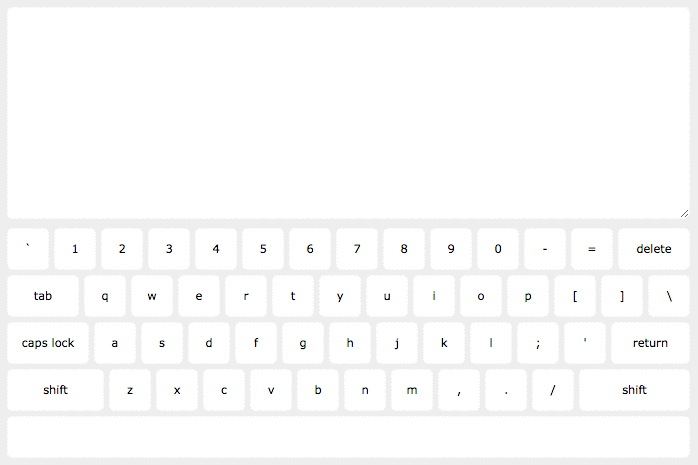
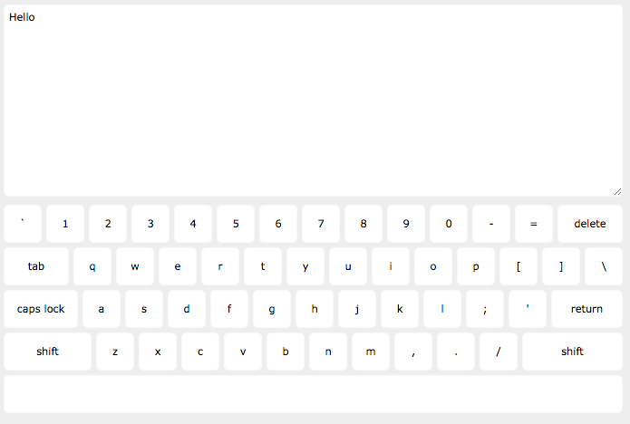
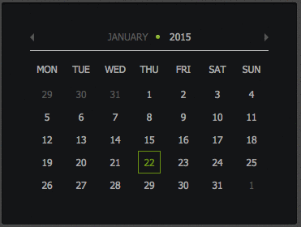
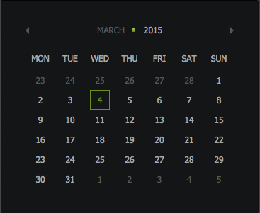

# jQuery Practice

## Description
Practice DOM traversal and manipulation

## Objectives

### Learning Objectives

After completing this assignment, you should...

* Be familiar with the different jQuery DOM traversal and manipulation methods
* Be familiar with jQuery event listeners
* Understand how to modify styles dynamically by adding classes

### Performance Objectives

After completing this assignment, you should be able to...

* Start a new jQuery project using bower

## Details

### Deliverables

* A repo containing at standard boilerplate with files for each mode:

### Requirements

* Todos/Plan of Attacks for each Mode

## Easy Mode

Recreate the accordion below using CSS, JavaScript, and jQuery.

### Files

* `accordian.html`
* `accordian.js`
* `accordian.css`

## Normal Mode

### Files

* `keyboard.html`
* `keyboard.js`
* `keyboard.css`

Recreate the keyboard below using CSS, JavaScript, and jQuery.
Without worrying about Shift or CapsLock state.

## Hard Mode

Add Shift and CapsLock to the keyboard

## Bonus Mode

### Files

* `calendar.html`
* `calendar.js`
* `calendar.css`

Recreate the calendar below using CSS, JavaScript, and jQuery.

