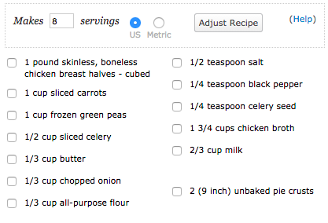
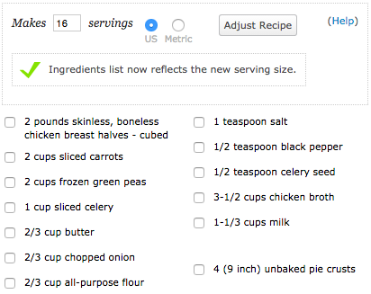

# recipe-component

## Objectives

After completing this assignment, you should be able to:

* Demonstrate understanding of Ember.js Components
* Demonstrate competence with Ember.js testing
* Demonstrate competence with Ember.js Objects and testing them

### Deliverables

* An ember-cli project hosted on Divshot
* An Issue in the Assignments Repo
* A repo containing up to date code
* A Pull Request (or more than one) containing developed features

### Requirements

* No JSHint warnings or errors
* Passing Tests

## Normal Mode

- [ ] Write at least one acceptance test to try to define the behavior of the recipe component described below before trying to implement the component.
- [ ] Create an HTTP Mock for recepie tests
- [ ] User should be able to see quanity of each ingredient

Create an `adjust-recipe` component that uses data returned from a route to
display a recipe, writing an acceptance test to drive the development of the
component from static HTML to data returned from a route.

## Hard Mode

Using test driven development, add computed properties and component actions
that allow you dynamically modify the yield of a recipe.

